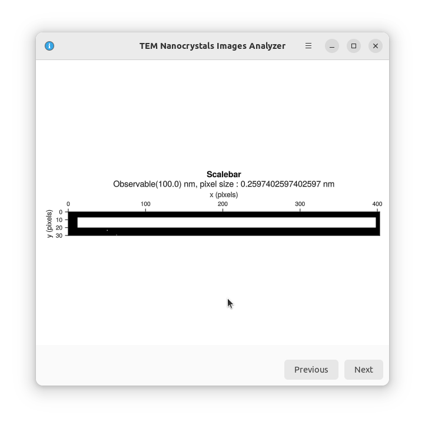

# TEM Nanocrystals Images Analyzer

This is an adaptation of the watershed algorithm described [here](https://juliaimages.org/latest/pkgs/segmentation/#Watershed) 
to get statistics on nanocrystals of perovskite imaged through Transmission 
Electron Microscopy (TEM). We have used it in papers reporting the synthesis of
these objects [[1]](https://doi.org/10.1039/D2CC01028C).

## User interface

The user interface comprises seven panels, which are documented below. Each panel
displays one or several figures, that you can save using the menu or by hitting
`Ctrl+S` (`Cmd+S` for Mac users). The screenshots below were recorded on a Linux
computer, you may experience some variations depending on your operating system.

### First panel: Image selection

Image selection and loading. You can load the image by clicking
on the `Browse...` button. Once done, you can click on `Next`.

### Second panel: Identification of the scale bar

The program needs to know the scale, so it can translate the sizes from pixels
to nanometers. Fill-in the size of the scale bar, then select it in the image view.

The program will look for the left-most and right-most white pixels in you selection.
This means you need to ensure that no unwanted white pixel remains in your selection.

You can visualize the result when you click on `Next`.

### Third panel: Thresholding

The program needs to know which pixels belong to the background and which pixels
don't. This is done by thresholding the image: we set a threshold gray level. If
a pixel is darker than the threshold it is in a nanocrystal, otherwise it is in
the background. 

This procedure can leave holes in the nanocrystal. You can try to patch them by
activating the `Seed Growing` option. Be aware that this operation is slow and
may lead to accidentally merging nanocrystals.

### Fourth panel: Distance transform

The fourth panel does not require any action on your part. It simply consists in
computing the distance transform of the image. That is, for each pixel in the image,
compute its distance to the background.

### Fifth panel: Markers

The program uses the watershed algorithm to distinguish between the nanocrystals.
The algorithm will be explained later, but for now we need to find for each
nanoparticle some pixels we are sure belong to the nanoparticle. We will call them
markers.

We will choose the pixels most distant to nanocrystal borders. You need to choose 
the corresponding quantile of pixels to set as starting points. As an example, 
if you choose 0.90 then, to be considered as a marker, a pixel must be farther 
away from the background than 90% of all the other pixels. To help, you can draw
the pixel distance distribution.

### Sixth panel: The watershed algorithm

The algorithm uses the "watershed" technique to find which nanoparticle each pixel 
belongs to. Basically you can imagine the distance transform to describe a set 
of valleys and mountains. Each marker (at the bottom of a valley, i.e. the farthest
away from the background as possible) sets the position of a water source. Each 
water source starts filling its valley, creating lakes. When two lakes meet, we
know we've found the separation between two nanoparticles. Note however that this
does not take into account the space between the nanoparticles and the background.
That is why in a second step we use the thresholded image we created at the 
begining to keep only the parts of the lakes that are in a nanoparticle.

### Seventh panel: Average size determination

We can then determine the average size of a nanoparticle. We do that by counting the 
number of pixel in each nanoparticle, and then taking the square root of this area.

For square nanoparticles, this yields the average side length. For rectangular
nanoparticles, this yields the geometric average of the two side lengths.

If you look at the "Labelled nanoparticles" image, you'll see that there are some
groups of nanoparticles that are detected as a unique nanoparticle. This will show in
the distribution as huge nanoparticles. Similarly, some noise pixels alone in the 
background can be detected as very small nanoparticles. To avoid that, you are 
allowed to threshold the size distribution around the expected size.
